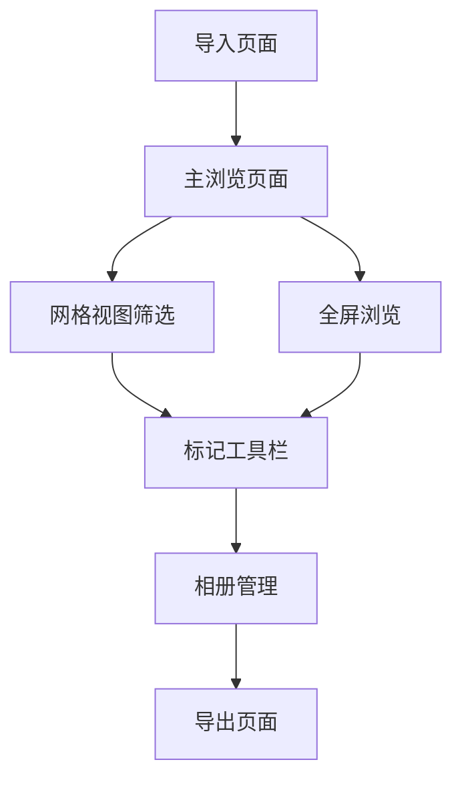

## 1. 产品概述
Culler是一款面向摄影师的轻量级macOS本地图片管理软件，专注于快速导入、整理、筛选大量照片，高效完成"选片"流程。不做复杂修图，专注管理与决策。

目标用户为专业摄影师、半职业摄影师以及对Lightroom复杂度或订阅模式不满意的摄影爱好者，提供极快的浏览筛选体验、清晰可控的本地数据结构。

## 2. 核心功能

### 2.1 用户角色
| 角色 | 注册方式 | 核心权限 |
|------|----------|----------|
| 本地用户 | 无需注册 | 完整使用所有功能，数据本地存储 |

### 2.2 功能模块
Culler包含以下核心页面：
1. **主浏览页面**：网格视图、单图视图、全屏浏览、筛选面板
2. **导入页面**：拖拽导入、SD卡导入、导入选项设置
3. **相册管理页面**：虚拟相册创建、标签管理、分类组织

### 2.3 页面详情
| 页面名称 | 模块名称 | 功能描述 |
|----------|----------|----------|
| 主浏览页面 | 网格视图 | 显示图片缩略图，支持虚拟滚动，异步加载预览图 |
| 主浏览页面 | 单图视图 | 大图显示，支持缩放、平移，显示EXIF信息 |
| 主浏览页面 | 全屏浏览 | 无干扰全屏模式，支持快速切换图片 |
| 主浏览页面 | 筛选面板 | 按评分、旗标、标签、相机、镜头、时间筛选 |
| 主浏览页面 | 标记工具栏 | 旗标(Pick/Reject)、星级评分(1-5)、颜色标签 |
| 导入页面 | 文件选择 | 支持拖拽文件/文件夹，SD卡/外接硬盘导入 |
| 导入页面 | 导入选项 | 引用模式或拷贝模式，自动去重，目标目录选择 |
| 相册管理页面 | 虚拟相册 | 创建基于规则或手动的虚拟相册 |
| 相册管理页面 | 标签系统 | 自定义标签创建和应用，支持多选筛选 |

## 3. 核心流程
### 摄影师选片流程
1. 导入照片 → 2. 快速浏览 → 3. 标记筛选 → 4. 导出保留

## 4. 用户界面设计
### 4.1 设计风格
- **主色调**：深色主题(#1a1a1a)，强调色为蓝色(#007AFF)
- **按钮样式**：扁平化设计，圆角4px，悬停效果
- **字体**：SF Pro，主要字号13-16pt
- **布局**：左侧导航+中间内容+右侧信息的三栏布局
- **图标风格**：线性图标，简洁现代

### 4.2 页面设计概览
| 页面名称 | 模块名称 | UI元素 |
|----------|----------|--------|
| 主浏览页面 | 网格视图 | 深色背景，缩略图间距8px，悬停显示快速操作按钮 |
| 主浏览页面 | 筛选面板 | 折叠式侧边栏，包含评分滑块、旗标按钮、标签云 |
| 主浏览页面 | 标记工具栏 | 底部工具栏，大按钮设计，支持自定义快捷键提示 |
| 导入页面 | 文件选择 | 大拖拽区域，显示支持格式，最近导入历史 |
| 相册管理页面 | 虚拟相册 | 树形结构，支持拖拽排序，右键菜单操作 |

### 4.3 响应式设计
桌面优先设计，针对macOS优化，支持触摸板手势操作，适配Retina显示屏。

### 4.4 性能要求
- 支持10,000+照片流畅浏览
- 启动时间<2秒
- 预览图异步加载，支持多级缓存
